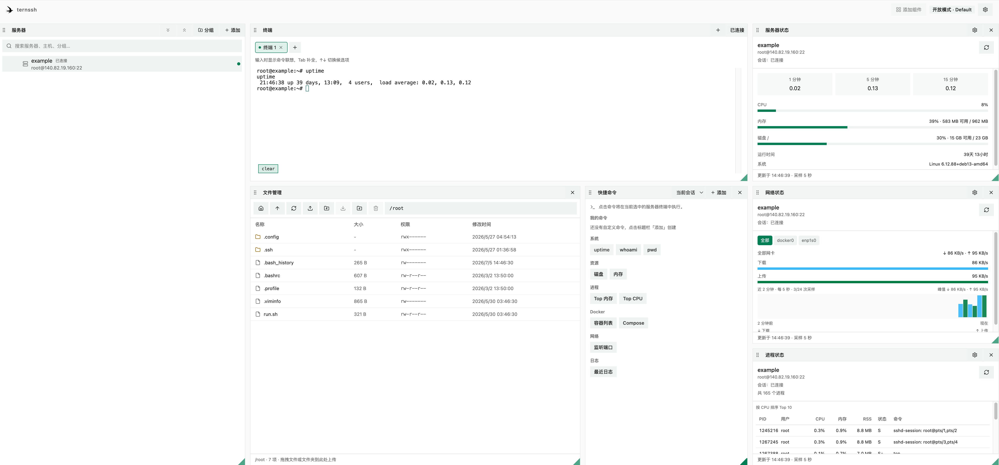

  <picture>
    <source media="(prefers-color-scheme: dark)" srcset="web/public/logo-dark.png" />
    <source media="(prefers-color-scheme: light)" srcset="web/public/logo-light.png" />
    
  </picture>

<h1 align="center">ternssh</h1>

  SSH workspace on Cloudflare 
  Draggable dashboard · Terminal · SFTP · Status monitoring

  <a href="LICENSE">GPL-3.0-or-later</a>
  ·
  <a href="README.md">中文</a>

  

  

---

**ternssh** is an SSH management tool that runs on Cloudflare Edge. Full documentation lives in the **[Wiki](https://github.com/HaradaKashiwa/ternssh/wiki)**.

## Deployment

See [Wiki · Deployment](https://github.com/HaradaKashiwa/ternssh/wiki/en-Deployment) for details.

## Authentication

**Open mode** is the default—no login required. For production, enable **Cloudflare Access** (Workers) or **HTTP Basic Auth** (Docker / self-hosted).

- **Cloudflare Access**: create a Self-hosted app in Zero Trust, then set `ACCESS_TEAM_DOMAIN` and `ACCESS_AUD` on the Worker
- **HTTP Basic Auth**: set both `BASICAUTH_USERNAME` and `BASICAUTH_PASSWORD` (Workers Dashboard or Docker env vars)

See [Wiki · Authentication](https://github.com/HaradaKashiwa/ternssh/wiki/en-Security#authentication) for details.
