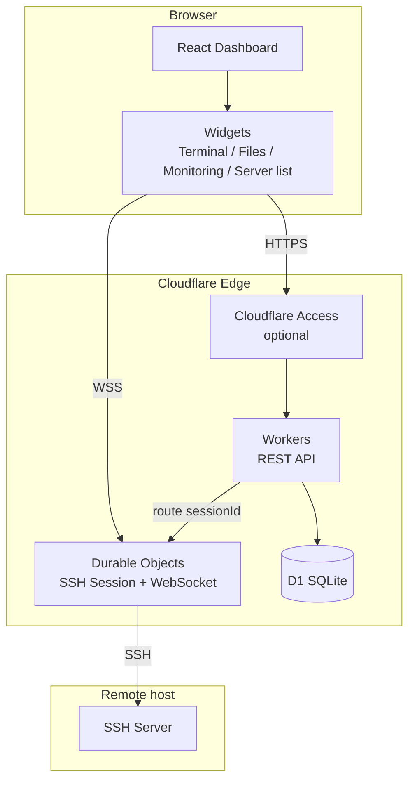

> [← README](../../README.en.md) · [Wiki](../README.md) · [中文](../zh/Home.md)
>
> [Overview](../en/Home.md) · [Features](../en/Features.md) · [Tech Stack](../en/Tech-Stack.md) · [Quick Start](../en/Getting-Started.md) · [Deployment](../en/Deployment.md) · [Project Structure](../en/Project-Structure.md) · **Architecture** · [Widgets](../en/Widgets.md) · [API](../en/API.md) · [Database](../en/Database.md) · [Settings](../en/Settings.md) · [Security](../en/Security.md) · [Configuration](../en/Configuration.md) · [Roadmap](../en/Roadmap.md) · [License](../en/License.md)

## Architecture

