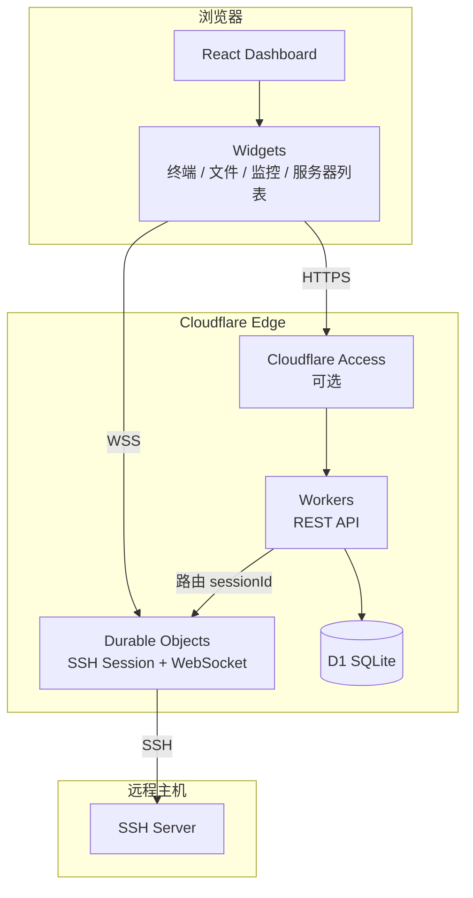

> [← README](../../README.md) · [Wiki](../README.md) · [English](../en/Home.md)
>
> [简介](../zh/Home.md) · [功能特性](../zh/Features.md) · [技术栈](../zh/Tech-Stack.md) · [快速开始](../zh/Getting-Started.md) · [部署](../zh/Deployment.md) · [项目结构](../zh/Project-Structure.md) · **系统架构** · [小部件](../zh/Widgets.md) · [API](../zh/API.md) · [数据库](../zh/Database.md) · [设置](../zh/Settings.md) · [安全](../zh/Security.md) · [配置](../zh/Configuration.md) · [路线](../zh/Roadmap.md) · [License](../zh/License.md)

## 系统架构

